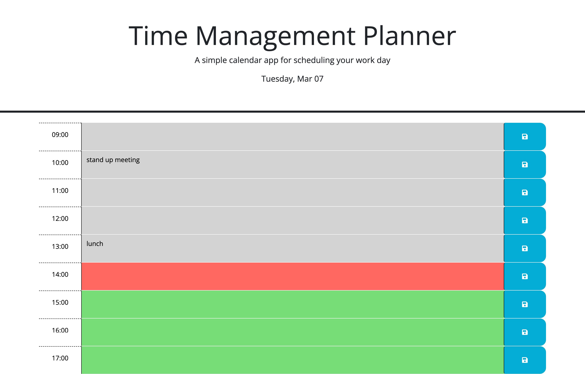

# Time-Managament-Planner

## Description

Provide a short description explaining the what, why, and how of your project. Use the following questions as a guide:

- What was your motivation?
- Why did you build this project? (Note: the answer is not "Because it was a homework assignment.")
- What problem does it solve?
- What did you learn?

With the Time Management Planner, users are able to see time blocks with business hours and input events as necessary. The time blocks are also color coded so the user can easily see what times have passed, what time it is currently, and what times are in the future. This is useful for someone who juggles a lot and has a busy schedule and likes to visibly see how much work they have accomplished throughout the day.

While building the time management planner, I learned about jQuery.

## Usage

To use the time management planner, you can click <a href="https://nyashanice.github.io/Time-Managament-Planner/">here</a>. On the site, you will be able to type your event or task in the colored areas and save them by clicking on the corresponding save button to the right. This saves your input in local storage.

